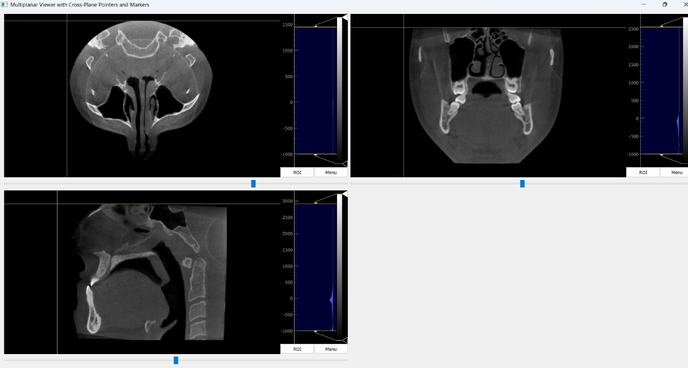
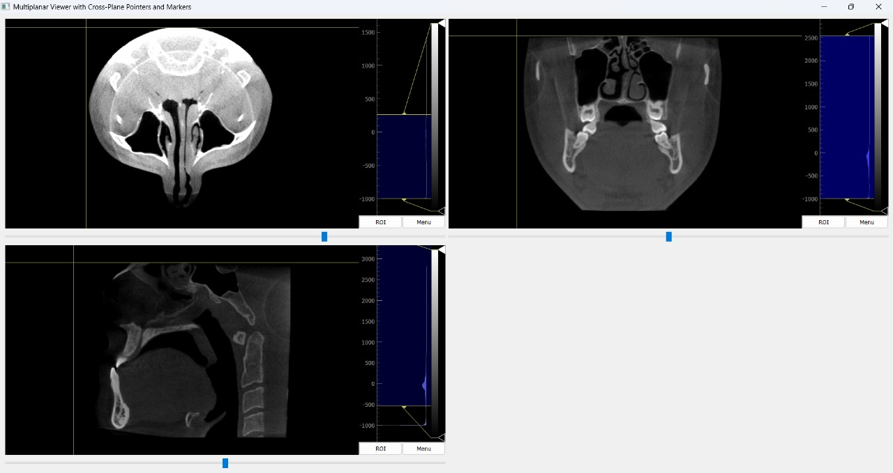
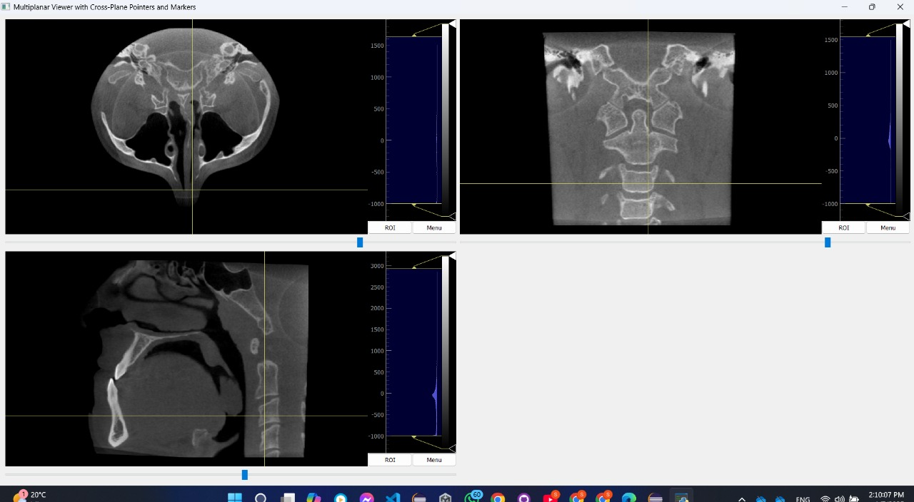

# Multiplanar Viewer with Cross-Plane Pointers and Markers

## Overview
This project is a Python-based medical imaging application inspired by **ITK-Snap**. The application provides a user-friendly interface to view and navigate DICOM images in multiplanar views (axial, coronal, and sagittal). It allows users to explore 3D medical image volumes with interactive features such as cross-plane pointers, slice navigation, and basic image manipulation tools.

## Features

### Multiplanar Image Viewports
- **Axial View**
- **Coronal View**
- **Sagittal View**

### Navigation Features
- Scroll through slices in each view using sliders.
- Indicate the selected slice on the other two planar views using cross-plane pointers.
- Interactive crosshair pointers that update dynamically based on clicks in any viewer.



### Image Manipulation Features
- **Zoom:** Zoom in and out using the mouse.
- **Brightness & Contrast:** Adjust brightness and contrast using the mouse.
- **Cine Mode:** Play, pause, and stop slice sequences in any viewer.



### Interactive Point Selection
- Select a single point in one of the views and view its corresponding location in all three 2D viewers.




## Installation

### Prerequisites
Ensure you have the following libraries installed:
- `SimpleITK`
- `PyDICOM`
- `PyQt5`
- `PyQtGraph`
- `NumPy`

You can install the dependencies using:
```bash
pip install SimpleITK pydicom PyQt5 pyqtgraph numpy
```

### Clone the Repository
Clone this repository to your local machine:
```bash
git clone https://github.com/engyelsarta/Multi_Planar_Viewer.git
cd Multi_Planar_Viewer
```

## Usage

### Running the Application
1. Place your DICOM files in a directory (e.g., `D:\Anatomy\Task1_ITK_Snap\DICOM`).
2. Update the `dicom_directory` variable in the `main()` function with the path to your DICOM directory.
3. Run the application:
```bash
python MPR.py
```

### Navigating the Viewer
- Use the horizontal sliders below each viewer to scroll through slices.
- Click on any viewer to update the cross-plane pointers in all views.
- Adjust zoom, brightness, and contrast with the mouse.

## Code Structure

### Key Components
- **`load_dicom(directory)`**
  - Loads the DICOM images from the specified directory.

- **`ClickableImageView`**
  - Extends `pyqtgraph.ImageView` to handle mouse click events and emit the clicked location.

- **`ViewerApp`**
  - Main application window that sets up the multiplanar viewers and interaction logic.

### Cross-Plane Pointer Logic
When a user clicks on one of the views, the clicked location is translated into corresponding coordinates in the 3D volume. The pointers in all views update dynamically, indicating the selected point's location in the 3D space.

## Requirements

### Functional Requirements
- Display multiplanar views (axial, coronal, sagittal) of DICOM images.
- Provide basic navigation features, including slice scrolling and cine playback.
- Show cross-plane pointers indicating the location of the selected point.
- Support zoom, brightness, and contrast adjustments using the mouse.

### Technical Requirements
- Python 3.7+
- Compatible with Windows, macOS, and Linux.

## Future Improvements
- Add support for saving and loading annotations.
- Implement advanced image processing tools such as segmentation and filtering.
- Improve cine playback performance.
- Add support for 3D rendering of the DICOM volume.

## License
This project is licensed under the MIT License. See the LICENSE file for details.

## Acknowledgments
- **ITK-Snap** for inspiration.
- Libraries used: `SimpleITK`, `PyDICOM`, `PyQt5`, `PyQtGraph`, `NumPy`.
